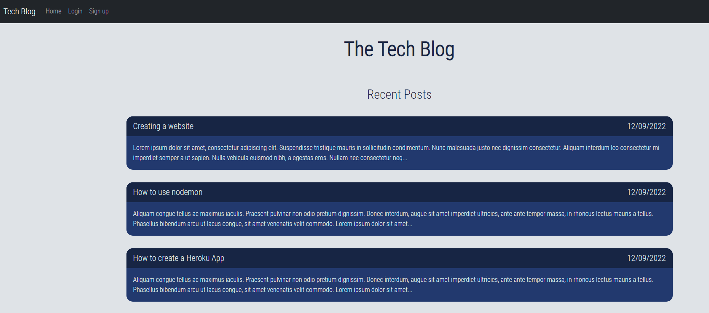

# Tech Blog [](https://opensource.org/licenses/MIT)

## Description
A blogging template that allows you to add, edit and delete blogs. Each blog also has the ability to add and delete comments. There is also a sign in/sign up feature.

Deployed to https://seang-tech-blog.herokuapp.com/

## Table of Contents
- [Installation](#installation)

- [Usage](#usage)

- [License](#license)



## Installation
To install the necessary dependencies, run the following command:

```

npm i

```

## Usage
- Git clone the repo

- Run the installation instructions

- You can use ```npm run watch``` if you want to make changes while the server is running (uses nodemon)

- Or you can do ```npm start``` if you want to start the server

## License
This project is licensed under the [MIT](https://opensource.org/licenses/MIT) license